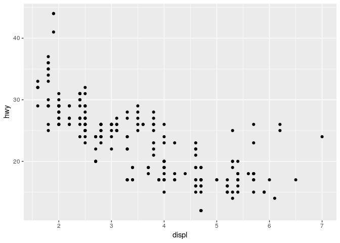
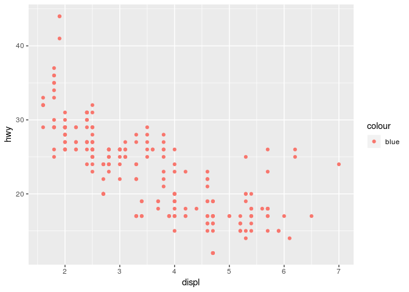

I Explore
================
Muhammad Aswan Syahputra
23 Juni 2018

2 Introduction
--------------

Tidak ada latihan.

3 Data Visualisation
--------------------

Mengaktifkan paket `tidyverse`:

    ## ── Attaching packages ─────────────────────────────────────── tidyverse 1.2.1 ──

    ## ✔ ggplot2 2.2.1.9000     ✔ purrr   0.2.5     
    ## ✔ tibble  1.4.2          ✔ dplyr   0.7.5     
    ## ✔ tidyr   0.8.1          ✔ stringr 1.3.1     
    ## ✔ readr   1.1.1          ✔ forcats 0.3.0

    ## ── Conflicts ────────────────────────────────────────── tidyverse_conflicts() ──
    ## ✖ dplyr::filter() masks stats::filter()
    ## ✖ dplyr::lag()    masks stats::lag()

Melihat sebagian data mpg dari paket ggplot2:

``` r
ggplot2::mpg
```

    ## # A tibble: 234 x 11
    ##    manufacturer model    displ  year   cyl trans   drv     cty   hwy fl   
    ##    <chr>        <chr>    <dbl> <int> <int> <chr>   <chr> <int> <int> <chr>
    ##  1 audi         a4         1.8  1999     4 auto(l… f        18    29 p    
    ##  2 audi         a4         1.8  1999     4 manual… f        21    29 p    
    ##  3 audi         a4         2    2008     4 manual… f        20    31 p    
    ##  4 audi         a4         2    2008     4 auto(a… f        21    30 p    
    ##  5 audi         a4         2.8  1999     6 auto(l… f        16    26 p    
    ##  6 audi         a4         2.8  1999     6 manual… f        18    26 p    
    ##  7 audi         a4         3.1  2008     6 auto(a… f        18    27 p    
    ##  8 audi         a4 quat…   1.8  1999     4 manual… 4        18    26 p    
    ##  9 audi         a4 quat…   1.8  1999     4 auto(l… 4        16    25 p    
    ## 10 audi         a4 quat…   2    2008     4 manual… 4        20    28 p    
    ## # ... with 224 more rows, and 1 more variable: class <chr>

Membuat scatterplot dari variabel displ vs hwy:

``` r
ggplot(data = mpg) + 
  geom_point(mapping = aes(x = displ, y = hwy))
```



**Latihan 3.2.4**

1.  Run ggplot(data = mpg). What do you see? (*Jalankan ggplot(data = mpg). Apa yang anda lihat?*)

``` r
ggplot(data = mpg)
```


Kode tersebut menghasilkan gambar latar untuk plot.

2.  How many rows are in mpg? How many columns? (*Terdapat berapa baris dan kolom pada data mpg?*)

``` r
nrow(mpg)
```

    ## [1] 234

``` r
ncol(mpg)
```

    ## [1] 11

Terdapat 234 baris dan 11 kolom pada data mpg.

3.  What does the drv variable describe? Read the help for ?mpg to find out. (*Apa informasi yang dimiliki variabel drv? Baca informasi pada laman bantuan dengan menjalankan ?mpg.*)

``` r
?mpg
```

Variabel drv memiliki informasi tentang *wheel-drive* yang terdiri atas tiga level, yaitu f (*front-wheel drive*), r (*rear wheel drive*), dan 4 (4wd).

4.  Make a scatterplot of hwy vs cyl. (*Buatlah scatterplot untuk variabel hwy vs cyl.*)

``` r
ggplot(mpg) +
  geom_point(aes(x = hwy, y = cyl))
```


5.  What happens if you make a scatterplot of class vs drv? Why is the plot not useful? (*Apa yang terjadi jika anda membuat scatterplot dari variabel class vs drv? Mengapa grafik tersebut tidak berguna?*)

``` r
ggplot(mpg) +
  geom_point(aes(x = class, y = drv))
```


Gambar diatas tidak berguna karena baik variabel class dan drv merupakan data kategori, sehingga grafik yang dihasilkan adalah pemetaan kombinasi antara kedua variabel tersebut.

Menambah *aesthetic* warna berdasarkan variabel class untuk scatterplot displ vs hwy:

``` r
ggplot(mpg) +
  geom_point(aes(x = displ, y = hwy, colour = class))
```


**Latihan 3.3.1**

1.  What’s gone wrong with this code? Why are the points not blue? (*Apa yang salah dengan kode berikut? Mengapa titik pada grafik tidak berwarna biru?*)

``` r
ggplot(data = mpg) + 
geom_point(mapping = aes(x = displ, y = hwy, color = "blue"))
```



Titik pada grafik tidak berwarna biru karena argumen `color` berada dalam *mapping* `aes`. Untuk membuat semua titik menjadi berwarna biru, argumen `color` harus berada diluar *mapping* seperti kode berikut:

``` r
ggplot(data = mpg) + 
geom_point(mapping = aes(x = displ, y = hwy), color = "blue")
```


2.  Which variables in mpg are categorical? Which variables are continuous? (Hint: type ?mpg to read the documentation for the dataset). How can you see this information when you run mpg? (*Variabel mana dari data mpg yang merupakan variabel kategori? Manakah yang merupakan variabel kontinyu? (Petunjuk: jalankan ?mpg untuk melihat dokumentasi dataset. Bagaimana cara anda mendapatkan informasi tersebut saat menjalankan kode `mpg`?)*)

``` r
mpg
```

    ## # A tibble: 234 x 11
    ##    manufacturer model    displ  year   cyl trans   drv     cty   hwy fl   
    ##    <chr>        <chr>    <dbl> <int> <int> <chr>   <chr> <int> <int> <chr>
    ##  1 audi         a4         1.8  1999     4 auto(l… f        18    29 p    
    ##  2 audi         a4         1.8  1999     4 manual… f        21    29 p    
    ##  3 audi         a4         2    2008     4 manual… f        20    31 p    
    ##  4 audi         a4         2    2008     4 auto(a… f        21    30 p    
    ##  5 audi         a4         2.8  1999     6 auto(l… f        16    26 p    
    ##  6 audi         a4         2.8  1999     6 manual… f        18    26 p    
    ##  7 audi         a4         3.1  2008     6 auto(a… f        18    27 p    
    ##  8 audi         a4 quat…   1.8  1999     4 manual… 4        18    26 p    
    ##  9 audi         a4 quat…   1.8  1999     4 auto(l… 4        16    25 p    
    ## 10 audi         a4 quat…   2    2008     4 manual… 4        20    28 p    
    ## # ... with 224 more rows, and 1 more variable: class <chr>

Variabel kategori: *manufacturer, model, trans, drv, fl, dan class* Variabel kontinyu: *displ, year, cyl, cty, dan hwy* Informasi tersebut dapat diketahui dengan membaca tipe kolom saat menjalankan fungsi `mpg`, yaitu <chr> untuk variabel kategori dan <dbl> dan <int> untuk variabel kontinyu.

3.  Map a continuous variable to color, size, and shape. How do these aesthetics behave differently for categorical vs. continuous variables? (*Buatlah grafik dengan menggunakan estetik warna, ukuran, dan bentuk untuk variabel kontinyu. Bagaimana penerapakn estetik tersebut untuk variabel kategori vs kontinyu?*)

**Estetik Warna**

``` r
ggplot(mpg) +
  geom_point(aes(x = displ, y = hwy, color = year))
```


**Estetik Ukuran**

``` r
ggplot(mpg) +
  geom_point(aes(x = displ, y = hwy, size = year))
```


**Estetik Bentuk**

``` r
ggplot(mpg) +
  geom_point(aes(x = displ, y = hwy, shape = year))
```

    ## Error: A continuous variable can not be mapped to shape


Estetik warna dan ukuran dapat diterapkan untuk variabel kontinyu, sedangkan estetik bentuk hanya bisa digunakan untuk variabel kategori.

4.  What happens if you map the same variable to multiple aesthetics? (*Apa yang terjadi jika anda menggunakan estetik ganda untuk variabel yang sama?*)

``` r
ggplot(mpg) +
  geom_point(aes(x = displ, y = hwy, color = year, size = year))
```


Estetik ganda dapat bekerja dengan baik untuk satu variabel yang sama. Grafik akan menampilkan legenda untuk tiap dengan estetik yang digunakan.

5.  What does the stroke aesthetic do? What shapes does it work with? (Hint: use ?geom\_point) (*Apa yang terjadi jika anda menggunakan estetik stroke? Dengan bentuk titik apa estetik tersebut dapat bekerja?*)

``` r
ggplot(mpg) +
  geom_point(aes(x = displ, y = hwy, stroke = cty), shape = 21)
```


Estetik *stroke* akan membuat tebal garis tepi yang berbeda. Estetik ini dapat bekerja untuk bentuk titik yang memiliki garis tepi.

6.  What happens if you map an aesthetic to something other than a variable name, like aes(colour = displ &lt; 5)? (*Apa yang terjadi jika anda menggunakan estetik bukan pada nama variabel, seperti aes(colour = displ &lt; 5)?*)

``` r
ggplot(mpg) +
  geom_point(aes(x = displ, y = hwy, colour = displ < 5))
```


Estetik juga dapat digunakan untuk ekspresi logika. Pada grafik tersebut, warna berbeda akan diberikan untuk nilai dibawah 5 (dengan label TRUE) dan diatas 5 (dengan nilai FALSE)
